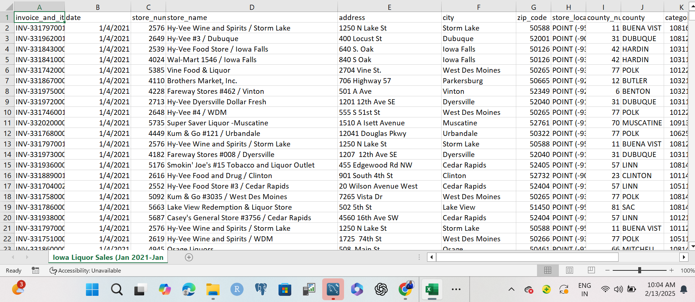
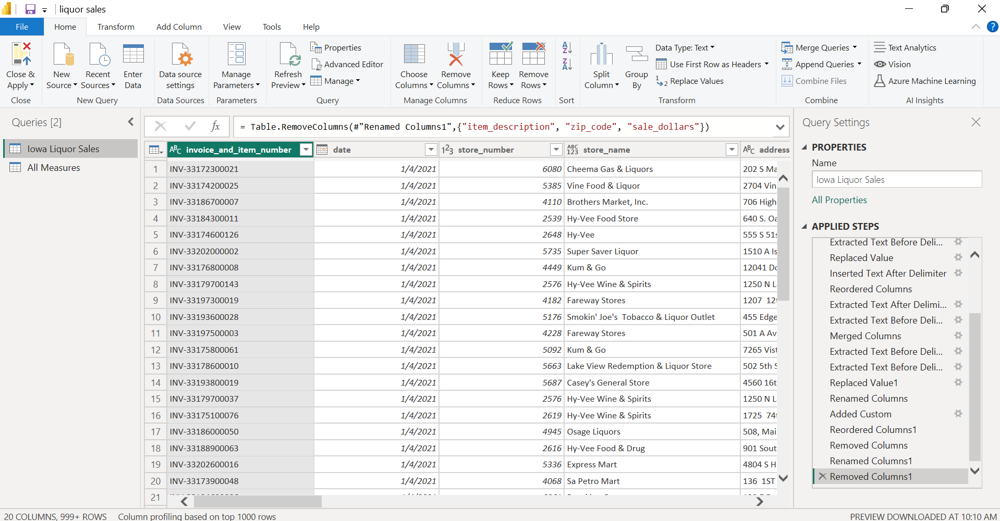
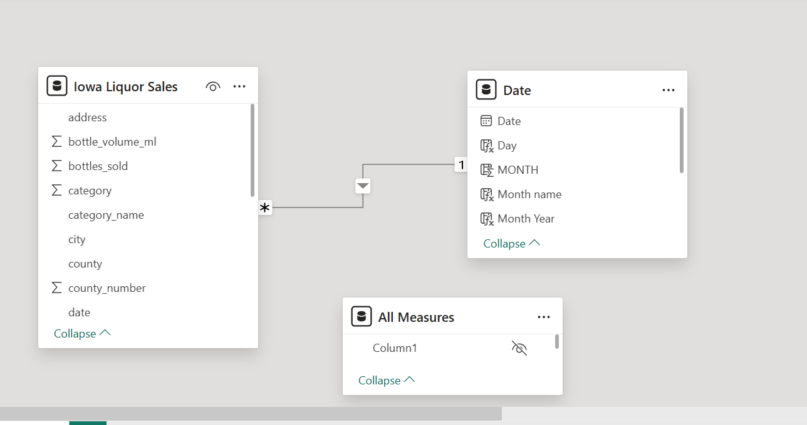

# Liquor Sales Analysis and visualization


## Project Overview
This project analyzes sales data to understand revenue distribution across different counties and products. The focus is on identifying the highest and lowest-performing counties, comparing their contributions to total sales, and examining the factors driving these differences. Population density, urbanization, and the presence of entertainment venues play a crucial role in sales performance, with urbanized counties contributing significantly more revenue.

Additionally, the project explores product-level sales trends, identifying the best-selling products and those with seasonal demand fluctuations. While some products maintain steady sales throughout the year, others experience sharp increases during specific periods, such as holidays. Understanding these patterns provides valuable insights into consumer purchasing behavior and market trends.

By leveraging data analysis and visualization, this project offers a comprehensive view of how sales are distributed across locations and product categories, helping businesses and stakeholders make informed decisions.

## Data Source
The data set used for ths project is gotten from kaggle

## Problem Statement

- Which product  generates the highest sales, and how does its performance compare to the lowest-performing product in terms of revenue and volume?
- Which county contributes the most to total sales, how does its performance compare to the lowest-performing county and what are the contributing factor?
- Which stores generate the highest revenue, and what factors contribute to their performance?
- How do monthly sales trends fluctuate, and are there specific days that consistently generate higher sales?

## Tools
- MySQL
- Power Bi

## Skills Demonstrated

- Data Cleaning
- Data Modelling
- Data Analysis
- Visualization
   - tooltip
   - DAX
   - Quick Measure
   - filters

### Data Cleaning

I converted data types to ensure consistency. I thoroughly cleaned the store name column by removing attached addresses, numbers, and excess spaces. I removed unnecessary columns to reduce redundancy. To validate data quality and identify errors, I conducted checks for data validity. I also performed exploratory data analysis to examine distinct values and detect null values, confirming that the dataset was error-free and had no missing data.

**Data cleaning in power bi (power query)**

Before Data Cleaning                                |                         After Data Cleaning
:--------------------------------------------------:|:--------------------------------------------:
               |         


**Data cleaning in MySQL**

```sql
EXPLORING THE DATA SET
DESCRIBE iowa_liquor_sales;

-- checking for null values
SELECT *
FROM iowa_liquor_sales  
WHERE county IS NULL
 OR store_name IS NULL
 OR category_name is null;
```

```sql
# DATA CLEANING
ALTER TABLE iowa_liquor_sales -- changing column name
CHANGE COLUMN `invoice_and_item_number`  invoice_and_item_number varchar(255);

ALTER TABLE iowa_liquor_sales
RENAME COLUMN sale_dollars TO sales;

UPDATE iowa_liquor_sales
SET date = str_to_date(date, '%m/%d/%Y');-- changing data type
ALTER TABLE iowa_liquor_sales
MODIFY COLUMN date DATE;

-- cleaning store_name irregularities
SELECT 
    store_name, 
    SUBSTRING_INDEX(store_name, '/', 1) AS store_name_clean
FROM iowa_liquor_sales;

ALTER Table iowa_liquor_sales
ADD store_name_clean varchar(100);

UPDATE iowa_liquor_sales
SET store_name_clean = SUBSTRING_INDEX(store_name, '/', 1);

Alter Table iowa_liquor_sales
ADD store_name_clean_2 varchar(100);

UPDATE iowa_liquor_sales
SET store_name_clean_2 = TRIM(REGEXP_REPLACE(store_name_clean, '(# ?[0-9]+)', ''));

Alter TABLE iowa_liquor_sales
ADD store_name_clean_3 varchar(100);

UPDATE iowa_liquor_sales
SET store_name_clean_3 = TRIM(
    REGEXP_REPLACE(store_name_clean_2, '[ ]?[A-Za-z-]*[0-9]+|[0-9]+[A-Za-z]*|[0-9]+', ''));

SELECT store_name_clean_2,
TRIM(
    REGEXP_REPLACE(store_name_clean_2, '[ ]?[A-Za-z-]*[0-9]+|[0-9]+[A-Za-z]*|[0-9]+', '')
)AS store_name_clean_3
from iowa_liquor_sales;

SELECT store_name_clean_3,
SUBSTRING_INDEX(store_name_clean_3, " -", 1) AS Store_name_clean_4
FROM iowa_liquor_sales;

Alter TABLE iowa_liquor_sales
ADD store_name_clean_4 varchar(100);

UPDATE iowa_liquor_sales
SET store_name_clean_4 = SUBSTRING_INDEX(store_name_clean_3, " -", 1);

SELECT *
FROM iowa_liquor_sales
WHERE store_name_clean_4 = '';

UPDATE iowa_liquor_sales
SET store_name_clean_4 = "Leo1"
WHERE store_name_clean_4 = '';

UPDATE iowa_liquor_sales
SET store_name_clean_4 = REPLACE(store_name_clean_4, 'and', '&')
WHERE store_name_clean_4 like '%and%';

ALTER TABLE iowa_liquor_sales
DROP COLUMN store_name;

ALTER TABLE iowa_liquor_sales
DROP COLUMN store_name_clean;

ALTER TABLE iowa_liquor_sales
DROP COLUMN store_name_clean_2;

ALTER TABLE iowa_liquor_sales
DROP COLUMN store_name_clean_3;

ALTER TABLE iowa_liquor_sales -- droping column
DROP COLUMN invalid_county_number;

ALTER TABLE iowa_liquor_sales
DROP COLUMN store_location;

ALTER TABLE iowa_liquor_sales
RENAME COLUMN store_name_clean_4 TO store_name;
```

### Data Modelling
The dataset is structured as a standalone table without relational connections to other tables, meaning it does not follow a star or snowflake schema. However, it is linked to the date table for time-based analysis.



### Data Analysis And Insight

- American vodkas consistently generate the highest monthly revenue, exceeding $3.5 million and accounting for 13.7% of total sales across 54 products. They also maintain a strong monthly demand of 14%. In contrast, cocktails and imported vodkas rank as the lowest-performing products, with a significantly lower demand of just 0.0005%. However, while top-selling products maintain steady demand year-round, certain products, such as temporary specials and cream liqours, experience a significant surge in sales during the holiday season.
- Polk County leads in total sales, generating $60 million monthly and accounting for over 21% of total sales among 100 counties. It dominates the top 10 highest-performing counties, while lower-performing counties like Fremont and Davis contribute just 0.012%.
   #### The key factors driving Top 10 high sales include:
   **Population Density & Urbanization** -> The top 10 highest-selling counties are primarily urbanized, featuring more entertainment venues, restaurants, and nightlife hotspots. Cities like Des Moines, Davenport, and Cedar Rapids see increased alcohol demand due to their vibrant social scenes.
   
   **Demographics & Store Distribution** –> A higher population density leads to more liquor stores being strategically located across the county, further driving overall sales.
- Hy-Vee Food Store generates the highest revenue, exceeding $3.6 million monthly, and accounts for 13.04% of total sales among the top 10 performing stores. this Top 10 store are located in county with great population density & urbanization like Plok, Scott, Linn etc. thus explains why they are the top performing stores compared to stores least performing located in the rural county areas like Adams, Fremont and Davis
- Monthly sales have fluctuated throughout the year but showed a steady increase in the fourth quarter. December 2021 recorded the highest sales of the year at $42 million, reflecting a $4 million increase from the previous month.

### Data Visualization

This visualization highlights key insights from the sales data, showcasing trends across products, counties, and stores. It provides a clear comparison of top-performing and low-performing categories, seasonal sales fluctuations, and revenue contributions. The analysis helps identify patterns in consumer demand and factors influencing sales performance.


